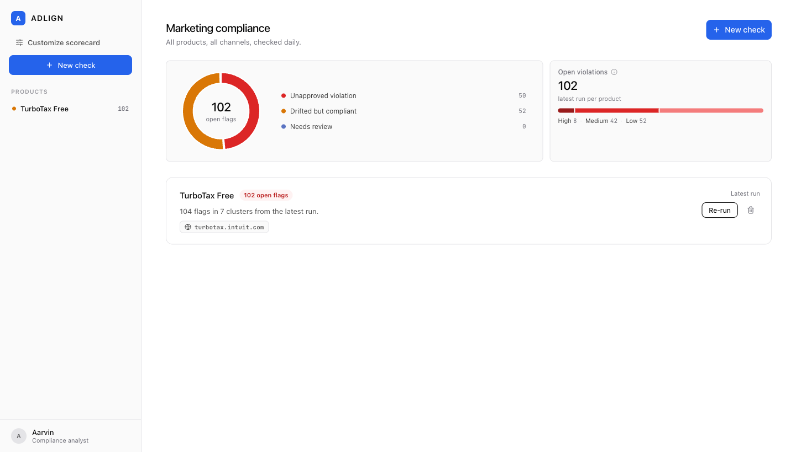
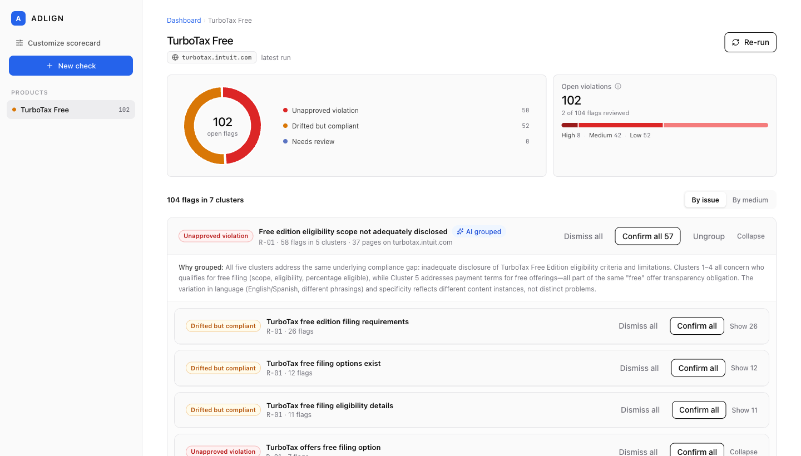
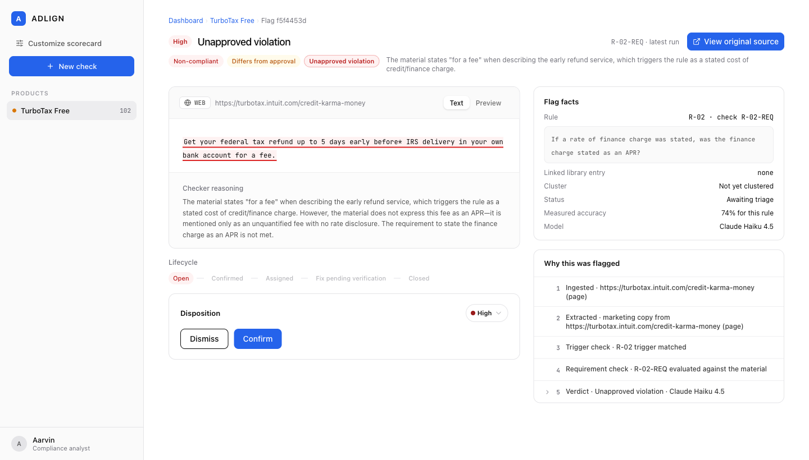
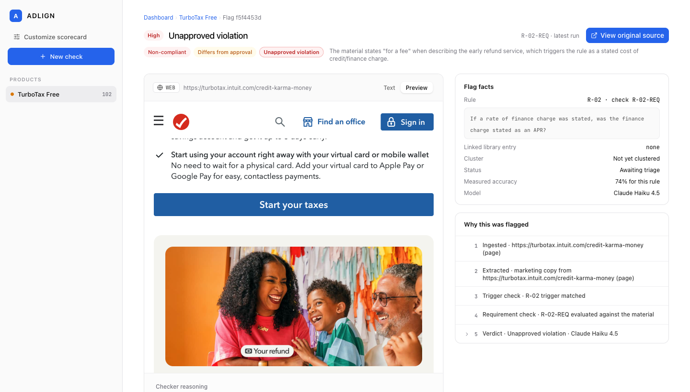
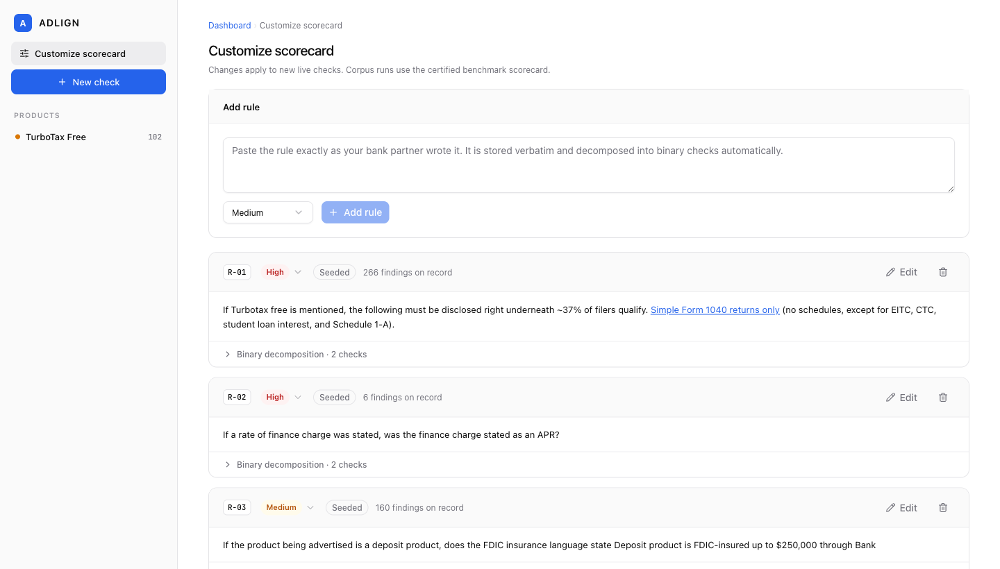
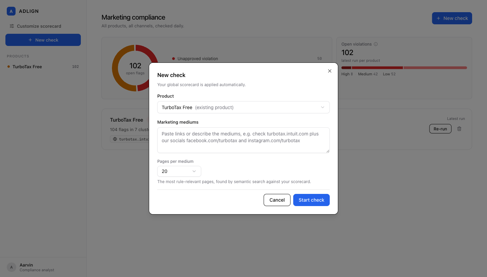

# Adlign

**A marketing compliance analysis tool for fintech and bank-partner teams.**

[](https://adlign.vercel.app)
[](#how-much-can-you-trust-it)

Every fintech that partners with a bank signs up for the same quiet obligation: everything the marketing team publishes has to satisfy the bank's compliance standards. Marketing ships pages, blog posts, and campaigns every week. Compliance reviews them one page at a time, after the fact, with a highlighter and a spreadsheet.

That gap is where violations live. A free-filing claim goes out without its eligibility disclosure. An approved FDIC line gets reworded by a well-meaning copywriter. Nobody notices until an auditor or a regulator does.

Adlign is a monitoring tool built for the analyst on the other side of that gap. You give it a scorecard (the rules your bank partner actually wrote) and your marketing properties. It reads every page, checks every rule against every material, and hands you back a triage-ready dashboard: what violates, what drifted from approved language, what needs a human call, and exactly which sentence is the problem on which page.

**Try it live: [adlign.vercel.app](https://adlign.vercel.app)**

The demo is preloaded with a real scan: TurboTax Free checked against a four-rule banking scorecard across turbotax.intuit.com, with 104 findings grouped into 7 issues.

---

## What you can do today

- **Run a check on any product.** Paste links or describe your marketing mediums in plain words. Adlign extracts the properties, discovers the most rule-relevant pages by semantic search against your scorecard, and scans them.
- **Read a dashboard that agrees with itself.** One definition of "violation" everywhere: the donut, the tiles, and the product pages all partition the same flags the same way.
- **Triage by issue, not by flag.** Findings with the same wording cluster automatically, and an AI grouping pass suggests which clusters are the same underlying issue, with its reasoning shown. Confirm or dismiss 58 flags in one click, or ungroup and handle them one by one. Undo included.
- **Open any flag down to the evidence.** The exact quoted sentence, highlighted in the page text as it was checked, with a live preview of the real page and the flagged line highlighted in place.
- **Act on it.** Confirm, dismiss, assign to a team, leave a note. Every flag moves through an explicit lifecycle (open, confirmed, assigned, fix pending verification, closed) and every action lands in an audit trail.
- **Edit the scorecard at runtime.** Paste a new rule exactly as your bank partner wrote it. It is stored verbatim and decomposed into binary checks automatically. Severity is editable per rule and overridable per flag.
- **See how much to trust each verdict.** Every flag shows the measured accuracy of the checker for that rule, from a frozen ground-truth evaluation. Not a vibe, a number.

## A look inside

### The dashboard

[](docs/screenshots/01-dashboard.png)

The portfolio view. The donut partitions all open flags by verdict type: unapproved violations, drift from approved language, and needs-review items that the checker declined to decide. The Open violations tile shows the same total sliced by severity. These numbers are computed from the same rows the product pages show, and there is an integration test that asserts the API's metrics equal an independent SQL aggregate, so the tiles cannot quietly drift from the truth.

### The flags dashboard

[](docs/screenshots/02-product-flags.png)

One product, one run, every finding. Flags cluster by identical wording, then an AI grouping pass proposes issue-level groups across clusters and explains why ("Cluster 2 is simply the Spanish-language version of Cluster 1"). Grouping is a view, not a decision: you can ungroup anything, and batch actions always show you the count before you commit. One-of-a-kind findings sit in their own "Individual findings" section so they get individual attention.

### The flag detail

[](docs/screenshots/03-flag-detail.png)

This is where an analyst decides. Left: the evidence quote highlighted in the page text exactly as it was checked, plus the checker's reasoning in plain language. Right: the flag facts (the verbatim rule, the linked approved-library entry, the model that judged it, and the measured accuracy for this rule) and a numbered "why this was flagged" chain from ingestion to verdict. Below: the lifecycle strip and the disposition controls.

Every flag carries three tags from a two-axis verdict:

| | Matches approved language | Differs from approved language |
|---|---|---|
| **Compliant** | All good | Drifted but compliant |
| **Non-compliant** | Approved but non-compliant | Unapproved violation |

Axis one asks "does this satisfy the rule?" Axis two asks "does it match the pre-approved library text?" The intersection is the finding type, and risk follows the matrix: a drifted-but-compliant finding recommends Low severity no matter how severe the rule is, because the content complies and only the wording wandered. Violations keep the rule's severity. You can override any of it, and overrides are audited.

### The live preview

[](docs/screenshots/04-flag-preview.png)

Flip the evidence panel from Text to Preview and Adlign renders the actual live page inline, scrolls to the flagged sentence, and highlights it. And when the page has changed since the run, it says so, right at the top, instead of pretending. The Text tab always shows the content exactly as it was checked.

### The scorecard

[](docs/screenshots/05-scorecard.png)

Rules are data, not code. Each rule is stored character for character as the bank partner wrote it (the checker never sees a paraphrase) and decomposed automatically into two binary checks: a trigger ("does this material even invoke the rule?") and a requirement ("if triggered, is it satisfied?"). Untriggered rules are not-applicable, never a free pass. Add a rule and the next live check uses it. Each rule shows how many findings it has produced.

### Starting a check

[](docs/screenshots/06-new-check.png)

Describe your mediums the way you would to a colleague. Adlign reads the site's sitemap, ranks every URL semantically against your scorecard, and scans the most rule-relevant pages up to your cap. You watch the run live, page by page, and the results land in the same dashboard.

## How a check actually works

1. **Discover.** For each web property, Adlign pulls the sitemap and ranks all URLs by semantic relevance to the scorecard. A 10,000-URL site becomes the 20 pages most likely to matter.
2. **Ingest.** Pages are fetched and stored first (content-addressed, deduplicated). Analysis always runs from the store, never from a live socket, so a run is reproducible.
3. **Retrieve.** For each page and rule, keyword-family retrieval builds match-centered evidence windows so the checker reads the relevant passage, not 17,000 characters of navigation.
4. **Check.** One structured LLM call per material and rule answers only two binary questions: trigger met, requirement met. Everything else (the two axes, the finding type, the verdict) is derived in code from those answers plus a programmatic comparison against the approved library text.
5. **Validate.** The evidence quote must appear verbatim in the stored page. If it does not, the verdict is degraded to needs-review automatically. The model is never trusted on evidence.
6. **Cluster and reconcile.** Identical findings group deterministically, the AI grouping pass proposes issue-level clusters with visible rationale, and every material is reconciled against the approved library to catch drift.

Shared page furniture (footers, cookie banners) is detected across pages and judged once, so a footer disclosure problem shows up as one issue with per-page flags, not forty separate mysteries.

## How much can you trust it

This is the question that matters for a compliance tool, so Adlign answers it with measurements instead of adjectives.

The checker is evaluated against a frozen ground truth of 367 records built by semantic discovery over the real site plus a three-model judge panel (Claude, GPT-5.1, GPT-5) with an arbiter for disagreements, split into train and held-out test sets. Against that ground truth the production checker measures:

| Rule | What it covers | Measured accuracy |
|---|---|---|
| R-01 | Free-product eligibility disclosure | 81% |
| R-02 | Finance charges stated as APR | 74% |
| R-03 | FDIC insurance language | 65% |
| R-04 | Bonus disclosure requirements | 100% |

Overall: 78.8% strict accuracy, 74.1% on the held-out test set the checker has never trained against. Evidence validity is 100% at every evaluation, because it is enforced in code, not requested in a prompt.

Three design decisions follow from taking those numbers seriously:

- **The number is in the product.** Every flag's detail panel shows the measured accuracy for its rule. Rules that have never been certified show "Not yet measured against ground truth" rather than borrowing a number.
- **There is no fake confidence.** Earlier versions displayed the model's self-reported confidence. Trace analysis across 1,552 verdicts showed it was uncalibrated (the rule the checker is worst at scored its highest self-confidence), so it was removed in favor of the measured numbers above.
- **The human is the verdict.** The score you present is the verified score, recomputed from analyst confirmations and dismissals, shown alongside the draft score. Dismissed flags count as passes once you dismiss them. Your triage decisions also feed the evaluation golden set, so the checker is graded against analyst judgment, not against itself.

In practice: treat Adlign as a tireless first-pass reviewer that reads everything and misses less than a skimming human, not as an oracle. It puts the evidence, the reasoning, the source page, and its own error rate in front of you, and leaves the call to you.

## Reusing it for your own product

Nothing about the pipeline is TurboTax-specific (there is a grep-verifiable guardrail for that). To point it at your own product:

1. Open Customize scorecard and replace the seeded rules with your bank partner's rules, pasted verbatim. Decomposition into binary checks is automatic.
2. Approved disclosure texts go in the library; rules link to entries, and drift detection compares pages against them character for character after normalization.
3. Start a new check with your domains. Page discovery, retrieval keywords for custom rules, and severity all derive from your scorecard at runtime.

Model choice is per-stage and provider-agnostic (Gemini, Groq, OpenAI, Anthropic), configured by environment variables, with cheap models as the default.

## Run it locally

You need Docker, Python 3.12 with [uv](https://docs.astral.sh/uv/), and Node 20+.

```bash
git clone https://github.com/AarvinGeorge/adlign-marketing-compliance-analyst.git
cd adlign-marketing-compliance-analyst

make db-up                                  # Postgres 16 + pgvector in Docker
cp .env.example apps/api/.env               # add your provider API keys
make dev-api                                # FastAPI on :8000
make dev-web                                # Next.js on :3000
```

`make test` runs the suite (198 tests, LLM calls replayed from cassettes so CI is deterministic and free). `make smoke` verifies your provider keys. The production stack (Caddy with automatic HTTPS, seeded demo database, hardened API) ships as `docker-compose.prod.yml` with a full runbook in [DEPLOY.md](DEPLOY.md).

## How it is built

The backend is **FastAPI** with a graph-orchestrated pipeline: ingestion, extraction, windowed retrieval, checking, reconciliation, and clustering as separate nodes with typed contracts, checkpointed in **Postgres** so a run can pause on a failed social fetch and resume from the database. Checking uses **LangChain** structured output (Claude Haiku 4.5 by default) with **LangSmith** tracing on every call. The frontend is **Next.js 15** with **Tailwind** and **shadcn/ui**, talking to the API through **TanStack Query**.

Every code file carries a meta header stating its purpose, contract, and dependencies. Scoring and verdict math live in one pure module with no LLM and no I/O, because numbers a compliance officer relies on should be readable in one place.

## Deployment and infrastructure

Production runs in two lanes, so the demo stays up even if one lane fails:

```
                         Visitor's browser
                        /                 \
        Vercel (frontend)                  VPS, self-contained fallback
  adlign.vercel.app                        Caddy (automatic HTTPS)
        |                                   ├─ /api/* -> FastAPI (LLM keys live here)
        |                                   │             └─ Postgres (Docker-internal,
        └── calls the VPS API ──────────────┘                seeded demo data)
            cross-origin (CORS)             └─ everything else -> Next.js
```

- **Frontend lane:** the Next.js app on Vercel, the shareable link. It calls the VPS API cross-origin, with the allowed origin pinned server-side.
- **Full-stack lane:** a single Hostinger VPS running Docker Compose: Caddy terminating HTTPS with automatic certificates, the same Next.js build, FastAPI, and Postgres reachable only inside the Docker network. The database seeds itself with the certified demo run on first boot, so a fresh volume comes up demo-ready.

**Continuous deployment is one push.** A push to main triggers two things in parallel: GitHub Actions rsyncs the code to the VPS, re-renders the server environment from GitHub secrets, rebuilds the stack, and smoke-checks the API health endpoint; Vercel builds and deploys the frontend from the same commit. GitHub is the single source of truth for production code and configuration. Nothing is hand-edited on the server, so the server cannot drift from the repo.

**Security posture, because this tool holds LLM keys:**

- Provider API keys exist in exactly one place: the server-side environment on the VPS, rendered from GitHub secrets on each deploy. The browser never sees a key, because every LLM call happens in the backend.
- The server is SSH-keys-only with a dedicated deploy key, and the firewall allows only SSH, 80, and 443. Postgres is not exposed to the internet at all.
- The public demo is hardened against abuse: a server-side cap on pages per live run, per-IP rate limiting on new checks, deletion protection on the seeded showcase runs, and hard monthly spend caps at the LLM providers as the final safety net.
- A failed run fails loudly: an unhandled provider failure marks the run as failed in the UI with the error recorded, rather than leaving a lane spinning forever.

The full from-scratch runbook (VPS provisioning, DNS or sslip.io, environment setup, launch checks, everyday operations, troubleshooting) lives in [DEPLOY.md](DEPLOY.md). Total infrastructure cost is about $5 to 8 per month for the VPS; the frontend lane and the CI pipeline are free-tier.

## Honest limitations and the road ahead

- **Retrieval is keyword-bound today.** If no keyword window matches, a rule is marked not-applicable without an LLM look. Semantic retrieval over pgvector embeddings is the next planned increment, and it targets exactly this blind spot.
- **One finding per page and rule.** A page that both passes and violates the same rule in different sections produces one verdict. A multi-finding runner is on the roadmap.
- **Social media fetching is best-effort.** Instagram and Facebook block scrapers aggressively; when a fetch fails, the run parks and offers a paste-content fallback rather than fabricating results.
- **Accuracy is disclosed, not solved.** 78.8% strict is the honest current number. The planned verifier pass (a second model auditing every flag) and the retrieval upgrade are both aimed at raising it, and every re-certification updates the numbers shown in the product.

## How this came to be

Adlign started as a three-day product trial with [Shibboleth](https://www.shibboleth.ai), a San Francisco company working on marketing compliance. Their brief supplied the problem statement this tool is built around: compliance review happens after publication, one page at a time, while marketing ships continuously. That framing (monitoring at volume, not one-off pre-approval) set the dashboard-first shape of the product, and the four-rule bank-partner scorecard in the demo is modelled on the one they provided.

What shipped here went well past the trial: a frozen 367-record ground-truth set, a measured accuracy number, semantic page discovery, live crawling, and a deployed full stack. The product was developed under the working title *Shiboleth* and renamed **Adlign** in July 2026.

## Acknowledgments

- [Shibboleth](https://www.shibboleth.ai), for the problem statement and the trial that started this.
- The demo scenario follows the FTC's public action on "free" tax-filing advertising, checked against a realistic bank-partner scorecard.
- Built with [Claude Code](https://claude.com/claude-code). Evaluation infrastructure runs on [LangSmith](https://smith.langchain.com).

Built by Aarvin George. The gap between what marketing ships and what compliance can read is measured in pages per week. This is an attempt to close it.
